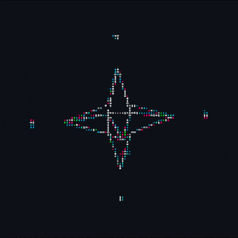

<div align="center">

&nbsp;
&nbsp;
&nbsp;
&nbsp;


</div>

<br>

<div align="center">
  
</div>

<br>

<table width="100%">
<tr>
<td width="36%" align="center" valign="top">

<br>

<!--  -->




<!-- <pre>
 ╔═══════════════════╗
 ║  FORK IT TECH     ║
 ║    ___________    ║
 ║   |     |     |   ║
 ║   | ▓▓▓ | ▓▓▓ |   ║
 ║   |_____|_____|   ║
 ║   |  ░░░░░░░  |   ║
 ║   |  ░ F I ░  |   ║
 ║   |  ░░░░░░░  |   ║
 ║    ‾‾‾‾‾‾‾‾‾‾‾    ║
 ║ Nocturnal v2.4    ║
 ╚═══════════════════╝
</pre> -->

<br>


</td>
<td width="64%" valign="top">

<br>

<pre>sourabh@forkit  ~  $</pre>

<!-- <pre>
╔─────────────────────────────────────────────╗
│  λ  OS       Arch Linux  x86_64             │
│  ⚙  Kernel   6.x.x-arch1                   │
│  ⏱  Uptime   ∞  (no sleep mode)            │
│  $  Shell    fish  4.x.x                   │
╠─────────────────────────────────────────────╣
│  💻 Host     Dell G15  (RTX 3050 Ti)        │
│  ⚡ CPU      Intel i7  12th Gen             │
│  🎮 GPU      NVIDIA RTX 3050 Ti Mobile      │
│  💾 RAM      8.4 GiB  / 16 GiB   (53%)     │
│  💿 Storage  ~238 GiB  NVMe SSD             │
╠─────────────────────────────────────────────╣
│  🪟 WM       Hyprland  (Wayland)            │
│  🎨 Theme    Nocturnal  / Dracula           │
│  🔤 Font     JetBrains Mono  Nerd Font      │
│  📺 Terminal kitty  0.x                     │
╠─────────────────────────────────────────────╣
│  ● ● ● ● ● ● ● ●   (color palette)         │
╚─────────────────────────────────────────────╝
</pre> -->

<pre>
╔─────────────────────────────────────────────╗
│              [ ABOUT_ME ]                   │
│  Building software that prioritizes         │
│  performance over abstraction. Focused      │
│  on systems design, distributed logic,      │
│  and memory-efficient architecture.         │
│                                             │
│  Founder @ Fork It Technologies            │
│  Builder of UPwell · Nexus · Engines       │
╚─────────────────────────────────────────────╝
</pre>

</td>
</tr>
</table>

<br>

<div align="center">

```
┌─────────────────────────────────────────────────────────┐
│                   $ cat tech_stack.conf                 │
└─────────────────────────────────────────────────────────┘
```

</div>

<table width="100%">
<tr>
<td width="50%" valign="top">

<pre>
  user    sourabh thakur
  host    forkit-technologies
  os      arch linux + hyprland
  uptime  grinding since day 1
  shell   fish + tmux
  editor  neovim (btw)
  pkgs    too many
  memory  always full
</pre>

</td>
<td width="50%" valign="top">

<pre>
  langs    C++20 · Python · Go · JS
  low-lvl  POSIX · Memory · C
  backend  Node.js · FastAPI · gRPC
  data     PostgreSQL · Redis · AppWrite
  arch     Distributed · Microservices
  sim      Rigid-Body · OpenGL · Vulkan
  infra    Docker · Linux · GitHub CI
  wm       Hyprland · i3 · kitty
</pre>

</td>
</tr>
</table>

<div align="center">


</div>

<br>

<div align="center">

```
┌─────────────────────────────────────────────────────────┐
│              $ gh api /stats --format=pretty            │
└─────────────────────────────────────────────────────────┘
```


</div>

<br>

<div align="center">


</div>

<br>

<div align="center">

```
┌─────────────────────────────────────────────────────────┐
│            $ ps aux | grep developer.service            │
└─────────────────────────────────────────────────────────┘
```

</div>

<table width="100%">
<tr>
<td width="50%" valign="top">

<pre>
╔────────────────────────────────────────╗
║       [ CURRENT_PROCESSES ]           ║
╠───────┬────────────────────┬──────────╣
║  PID  │  TASK              │ STATUS   ║
╠───────┼────────────────────┼──────────╣
║  001  │ UPwell Platform    │ BUILDING ║
║  002  │ Physics Engine C++ │ RUNNING  ║
║  003  │ Fork It Branding   │ ACTIVE   ║
║  004  │ GATE Prep          │ DAILY    ║
║  005  │ Nexus AI OS        │ STABLE   ║
╚───────┴────────────────────┴──────────╝
</pre>

</td>
<td width="50%" valign="top">

<pre>
╔────────────────────────────────────────╗
║       [ SYSTEM_RESOURCES ]            ║
╠────────────────┬───────────────────────╣
║  CPU LOAD      │ ████████░░░░  62%    ║
║  RAM USAGE     │ ███████░░░░░  53%    ║
║  GPU VRAM      │ █████░░░░░░░  40%    ║
║  STORAGE       │ ███████████░  88%    ║
║  UPTIME        │ ∞  days              ║
╚────────────────┴───────────────────────╝
</pre>

</td>
</tr>
</table>

<br>

<div align="center">

```
┌─────────────────────────────────────────────────────────┐
│           $ ls -la ~/projects | grep ACTIVE             │
└─────────────────────────────────────────────────────────┘
```

</div>

<table width="100%">
<tr>
<td width="33%" align="center" valign="top">

<pre>
╔══════════════════════╗
║  🩺 UPwell           ║
╠══════════════════════╣
║  Mental health       ║
║  platform for        ║
║  students. AI chat   ║
║  + counsellor layer  ║
╠══════════════════════╣
║  Next.js · AppWrite  ║
║  Express · Python    ║
║  STATUS: BUILDING    ║
╚══════════════════════╝
</pre>

</td>
<td width="33%" align="center" valign="top">

<pre>
╔══════════════════════╗
║  ⚙ Physics Engine   ║
╠══════════════════════╣
║  Custom 2D/3D        ║
║  renderer with       ║
║  rigid-body gravity  ║
║  simulation          ║
╠══════════════════════╣
║  C++20 · OpenGL      ║
║  GLSL · GLFW         ║
║  STATUS: RUNNING     ║
╚══════════════════════╝
</pre>

</td>
<td width="33%" align="center" valign="top">

<pre>
╔══════════════════════╗
║  🤖 Nexus            ║
╠══════════════════════╣
║  Personal AI OS      ║
║  Telegram + Mistral  ║
║  7B · Obsidian       ║
║  vault integration   ║
╠══════════════════════╣
║  Python · Ollama     ║
║  systemd · Telegram  ║
║  STATUS: STABLE      ║
╚══════════════════════╝
</pre>

</td>
</tr>
</table>

<br>

<div align="center">

```
┌─────────────────────────────────────────────────────────┐
│                $ cat /etc/socials.conf                  │
└─────────────────────────────────────────────────────────┘
```

[](https://github.com/sourabh-thakur12)
[](https://linkedin.com/in/sourabh-thakur-100mnist)
[](mailto:sourabh@fork-it.in)

</div>

<br>

<div align="center">

```
$ systemctl status developer.service --no-pager
```

```
● developer.service — Fork It Technologies Core
   Loaded: loaded (/etc/systemd/user/developer.service; enabled)
   Active: active (running) since boot
  Process: [sourabh-thakur12] building things that matter
 Main PID: 1 (init — curiosity)
   CGroup: /user.slice/developer.service
           ├─ systems  (arch + hyprland + neovim)
           ├─ stack    (c++ · python · node · opengl)
           └─ focus    (upwell · physics · nexus)
```


<sub>crafted with 🖤 on arch linux · hyprland · nocturnal theme</sub>

</div>
